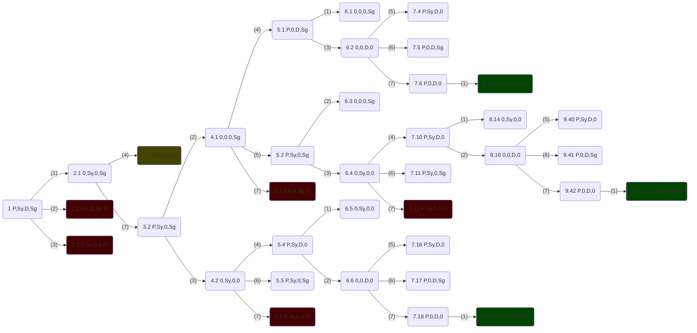
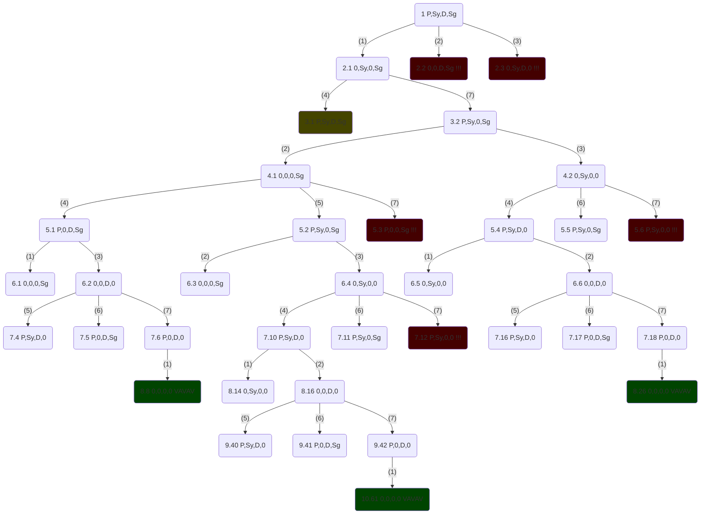

# Vertical

```mermaid

%% Overall;
graph LR
  1.0(1 P,Sy,D,Sg) --(1)--> 2.1(2.1 0,Sy,0,Sg)
  1.0(1 P,Sy,D,Sg) --(2)--> 2.2(2.2 0,0,D,Sg !!!)
  1.0(1 P,Sy,D,Sg) --(3)--> 2.3(2.3 0,Sy,D,0 !!!)
  
  2.1(2.1 0,Sy,0,Sg) --(4)--> 3.1(3.1 P,Sy,D,Sg)
  %% 2.1(2.1 0,Sy,0,Sg) --(5)--> 3.#(3.#)
  %% 2.1(2.1 0,Sy,0,Sg) --(6)--> 3.#(3.#)
  2.1(2.1 0,Sy,0,Sg) --(7)--> 3.2(3.2 P,Sy,0,Sg)
  
  %% 3.1(3.1 P,Sy,D,Sg) --(Initial state)--> 1.0(1.0 P,Sy,D,Sg)
  
  %% 3.2(3.2 P,Sy,0,Sg) --(1)--> 4.#(4.# f)
  3.2(3.2 P,Sy,0,Sg) --(2)--> 4.1(4.1 0,0,0,Sg)
  3.2(3.2 P,Sy,0,Sg) --(3)--> 4.2(4.2 0,Sy,0,0)
  
  4.1(4.1 0,0,0,Sg) --(4)--> 5.1(5.1 P,0,D,Sg)
  4.1(4.1 0,0,0,Sg) --(5)--> 5.2(5.2 P,Sy,0,Sg)
  %% 4.1(4.1 0,Sy,0,Sg) --(6)--> 5.#(5.#)
  4.1(4.1 0,0,0,Sg) --(7)--> 5.3(5.3 P,0,0,Sg !!!)
  
  4.2(4.2 0,Sy,0,0) --(4)--> 5.4(5.4 P,Sy,D,0)
  %% 4.2(4.2 0,Sy,0,0) --(5)--> 5.#(5.# P,Sy,0,0)
  4.2(4.2 0,Sy,0,0) --(6)--> 5.5(5.5 P,Sy,0,Sg)
  4.2(4.2 0,Sy,0,0) --(7)--> 5.6(5.6 P,Sy,0,0 !!!)
  
  5.1(5.1 P,0,D,Sg) --(1)--> 6.1(6.1 0,0,0,Sg)
  %% 5.1(5.1 P,0,D,Sg) --(2)--> 6.#(6.#)
  5.1(5.1 P,0,D,Sg) --(3)--> 6.2(6.2 0,0,D,0)
  
  %% 5.2(5.2 P,Sy,0,Sg) --(1)--> 6.#(6.#)
  5.2(5.2 P,Sy,0,Sg) --(2)--> 6.3(6.3 0,0,0,Sg)
  5.2(5.2 P,Sy,0,Sg) --(3)--> 6.4(6.4 0,Sy,0,0)
  
  5.4(5.4 P,Sy,D,0) --(1)--> 6.5(6.5 0,Sy,0,0)
  5.4(5.4 P,Sy,D,0) --(2)--> 6.6(6.6 0,0,D,0)
  %% 5.4(5.4 P,Sy,D,0) --(3)--> 6.#(6.#)
  
  %% 5.5(5.5 P,Sy,0,Sg) --(1)--> 6.#(6.#)
%%5.5(5.5 P,Sy,0,Sg) --(2)--> 6.7(6.7 0,0,0,Sg)
%%5.5(5.5 P,Sy,0,Sg) --(3)--> 6.8(6.8 0,Sy,0,0)
  
%%6.1(6.1 0,0,0,Sg) --(4)--> 7.1(7.1 P,0,D,Sg)
%%6.1(6.1 0,0,0,Sg) --(5)--> 7.2(7.2 P,Sy,0,Sg)
  %% 6.1(6.1 0,0,0,Sg) --(6)--> 7.#(7.#)
%%6.1(6.1 0,0,0,Sg) --(7)--> 7.3(7.3 P,0,0,Sg !!!)
  
  %% 6.2(6.2 0,0,D,0) --(4)--> 7.(7. P,0,D,Sg)
  6.2(6.2 0,0,D,0) --(5)--> 7.4(7.4 P,Sy,D,0)
  6.2(6.2 0,0,D,0) --(6)--> 7.5(7.5 P,0,D,Sg)
  6.2(6.2 0,0,D,0) --(7)--> 7.6(7.6 P,0,D,0)
  
%%6.3(6.3 0,0,0,Sg) --(4)--> 7.7(7.7 P,0,D,Sg)
%%6.3(6.3 0,0,0,Sg) --(5)--> 7.8(7.8 P,Sy,0,Sg)
  %% 6.3(6.3 0,0,0,Sg) --(6)--> 7.#(7.#)
%%6.3(6.3 0,0,0,Sg) --(7)--> 7.9(7.9 P,0,0,Sg !!!)
  
  6.4(6.4 0,Sy,0,0) --(4)--> 7.10(7.10 P,Sy,D,0)
  %% 6.4(6.4 0,Sy,0,0) --(5)--> 7.(7.)
  6.4(6.4 0,Sy,0,0) --(6)--> 7.11(7.11 P,Sy,0,Sg)
  6.4(6.4 0,Sy,0,0) --(7)--> 7.12(7.12 P,Sy,0,0 !!!)
  
%%6.5(6.5 0,Sy,0,0) --(4)--> 7.13(7.13 P,Sy,D,0)
  %% 6.5(6.5 0,Sy,0,0) --(5)--> 7.(7.)
%%6.5(6.5 0,Sy,0,0) --(6)--> 7.14(7.14 P,Sy,0,Sg)
%%6.5(6.5 0,Sy,0,0) --(7)--> 7.15(7.15 P,Sy,0,0 !!!)
  
  %% 6.6(6.6 0,0,D,0) --(4)--> 7.(7. P,0,D,Sg)
  6.6(6.6 0,0,D,0) --(5)--> 7.16(7.16 P,Sy,D,0)
  6.6(6.6 0,0,D,0) --(6)--> 7.17(7.17 P,0,D,Sg)
  6.6(6.6 0,0,D,0) --(7)--> 7.18(7.18 P,0,D,0)
  
%%6.7(6.7 0,0,0,Sg) --(4)--> 7.19(7.19 P,0,D,Sg)
%%6.7(6.7 0,0,0,Sg) --(5)--> 7.20(7.20 P,Sy,0,Sg)
  %% 6.7(6.7 0,0,0,Sg) --(6)--> 7.#(7.#)
%%6.7(6.7 0,0,0,Sg) --(7)--> 7.21(7.21 P,0,0,Sg !!!)
  
%%6.8(6.8 0,Sy,0,0) --(4)--> 7.22(7.22 P,Sy,D,0)
  %% 6.8(6.8 0,Sy,0,0) --(5)--> 7.(7.)
%%6.8(6.8 0,Sy,0,0) --(6)--> 7.23(7.23 P,Sy,0,Sg)
%%6.8(6.8 0,Sy,0,0) --(7)--> 7.24(7.24 P,Sy,0,0 !!!)
  
%%7.1(7.1 P,0,D,Sg) --(1)--> 8.1(8.1 0,0,0,Sg)
  %% 7.1(7.1 P,0,D,Sg) --(2)--> 8.#(8.#)
%%7.1(7.1 P,0,D,Sg) --(3)--> 8.2(8.2 0,0,D,0)
  
  %% 7.2(7.2 P,Sy,0,Sg) --(1)--> 8.#(6.#)
%%7.2(7.2 P,Sy,0,Sg) --(2)--> 8.3(8.3 0,0,0,Sg)
%%7.2(7.2 P,Sy,0,Sg) --(3)--> 8.4(8.4 0,Sy,0,0)
  
%%7.4(7.4 P,Sy,D,0) --(1)--> 8.5(8.5 0,Sy,0,0)
%%7.4(7.4 P,Sy,D,0) --(2)--> 8.6(8.6 0,0,D,0)
  %% 7.4(7.4 P,Sy,D,0) --(3)--> 8.#(8.#)
  
%%7.5(7.5 P,0,D,Sg) --(1)--> 8.7(8.7 0,0,0,Sg)
  %% 7.5(7.5 P,0,D,Sg) --(2)--> 8.#(8.#)
%%7.5(7.5 P,0,D,Sg) --(3)--> 8.8(8.8 0,0,D,0)
  
  7.6(7.6 P,0,D,0) --(1)--> 8.9(8.8 0,0,0,0 VAVAV)
  %% 7.6(7.6 P,0,D,Sg) --(2)--> 8.#(8.#)
  %% 7.6(7.6 P,0,D,0) --(3)--> 8.#(8.#)
  
%%7.7(7.7 P,0,D,Sg) --(1)--> 8.10(8.10 0,0,0,Sg)
  %% 7.7(7.7 P,0,D,Sg) --(2)--> 8.#(8.#)
%%7.7(7.7 P,0,D,Sg) --(3)--> 8.11(8.11 0,0,D,0)
  
  %% 7.8(7.8 P,Sy,0,Sg) --(1)--> 8.#(8.#)
%%7.8(7.8 P,Sy,0,Sg) --(2)--> 8.12(8.12 0,0,0,Sg)
%%7.8(7.8 P,Sy,0,Sg) --(3)--> 8.13(8.13 0,Sy,0,0)
  
  7.10(7.10 P,Sy,D,0) --(1)--> 8.14(8.14 0,Sy,0,0)
  7.10(7.10 P,Sy,D,0) --(2)--> 8.15(8.15 0,0,D,0)
  %% 7.10(7.10 P,Sy,D,0) --(3)--> 8.#(8.#)
  
  %% 7.11(7.11 P,Sy,0,Sg) --(1)--> 8.#(8.#)
%%7.11(7.11 P,Sy,0,Sg) --(2)--> 8.16(8.16 0,0,0,Sg)
%%7.11(7.11 P,Sy,0,Sg) --(3)--> 8.17(8.17 0,Sy,0,0)
  
%%7.13(7.13 P,Sy,D,0) --(1)--> 8.18(8.18 0,Sy,0,0)
%%7.13(7.13 P,Sy,D,0) --(2)--> 8.19(8.19 0,0,D,0)
  %% 7.13(7.13 P,Sy,D,0) --(3)--> 8.#(8.#)
  
  %% 7.14(7.14 P,Sy,0,Sg) --(1)--> 8.#(8.20 0,Sy,0,0)
%%7.14(7.14 P,Sy,0,Sg) --(2)--> 8.20(8.20 0,0,0,Sg)
%%7.14(7.14 P,Sy,0,Sg) --(3)--> 8.21(8.21 0,Sy,0,0)
  
%%7.16(7.16 P,Sy,D,0) --(1)--> 8.22(8.22 0,Sy,0,0)
%%7.16(7.16 P,Sy,D,0) --(2)--> 8.23(8.23 0,0,D,0)
  %% 7.16(7.16 P,Sy,D,0) --(3)--> 8.#(8.#)
  
%%7.17(7.17 P,0,D,Sg) --(1)--> 8.24(8.24 0,0,0,Sg)
  %% 7.17(7.17 P,0,D,Sg) --(2)--> 6.#(6.#)
%%7.17(7.17 P,0,D,Sg) --(3)--> 8.25(8.25 0,0,D,0)
  
  7.18(7.18 P,0,D,0) --(1)--> 8.26(8.26 0,0,0,0 VAVAV)
  %% 7.18(7.18 P,0,D,0) --(2)--> 8.(8. 0,0,0,Sg)
  %% 7.18(7.18 P,0,D,0) --(3)--> 8.(8. 0,Sy,0,0)
  
%%7.19(7.19 P,0,D,Sg) --(1)--> 8.27(8.27 0,0,0,Sg)
  %% 7.19(7.19 P,0,D,Sg) --(2)--> 6.#(6.#)
%%7.19(7.19 P,0,D,Sg) --(3)--> 8.28(8.28 0,0,D,0)
  
  %% 7.20(7.20 P,Sy,0,Sg) --(1)--> 8.#(8.# 0,Sy,0,0)
%%7.20(7.20 P,Sy,0,Sg) --(2)--> 8.29(8.29 0,0,0,Sg)
%%7.20(7.20 P,Sy,0,Sg) --(3)--> 8.30(8.30 0,Sy,0,0)
  
%%7.22(7.22 P,Sy,D,0) --(1)--> 8.31(8.31 0,Sy,0,0)
%%7.22(7.22 P,Sy,D,0) --(2)--> 8.32(8.32 0,0,D,0)
  %% 7.22(7.22 P,Sy,D,0) --(3)--> 8.#(8.#)
  
  %% 7.23(7.23 P,Sy,0,Sg) --(1)--> 8.#(8.# 0,Sy,0,0)
%%7.23(7.23 P,Sy,0,Sg) --(2)--> 8.33(8.33 0,0,0,Sg)
%%7.23(7.23 P,Sy,0,Sg) --(3)--> 8.34(8.34 0,Sy,0,0)
  
  %% 8.2(8.2 0,0,D,0) --(4)--> 9.(9. P,0,D,Sg)
%%8.2(8.2 0,0,D,0) --(5)--> 9.4(9.4 P,Sy,D,0)
%%8.2(8.2 0,0,D,0) --(6)--> 9.5(9.5 P,0,D,Sg)
%%8.2(8.2 0,0,D,0) --(7)--> 9.6(9.6 P,0,D,0)
  
  %% 8.6(8.6 0,0,D,0) --(4)--> 9.(9. P,0,D,Sg)
%%8.6(8.6 0,0,D,0) --(5)--> 9.16(9.16 P,Sy,D,0)
%%8.6(8.6 0,0,D,0) --(6)--> 9.17(9.17 P,0,D,Sg)
%%8.6(8.6 0,0,D,0) --(7)--> 9.18(9.18 P,0,D,0)
  
  %% 8.8(8.8 0,0,D,0) --(4)--> 9.(9. P,0,D,Sg)
%%8.8(8.8 0,0,D,0) --(5)--> 9.22(9.22 P,Sy,D,0)
%%8.8(8.8 0,0,D,0) --(6)--> 9.23(9.23 P,0,D,Sg)
%%8.8(8.8 0,0,D,0) --(7)--> 9.24(9.24 P,0,D,0)
  
  %% 8.11(8.11 0,0,D,0) --(4)--> 9.(9. P,0,D,Sg)
%%8.11(8.11 0,0,D,0) --(5)--> 9.28(9.28 P,Sy,D,0)
%%8.11(8.11 0,0,D,0) --(6)--> 9.29(9.29 P,0,D,Sg)
%%8.11(8.11 0,0,D,0) --(7)--> 9.30(9.30 P,0,D,0)
  
  %% 8.15(8.11 0,0,D,0) --(4)--> 9.(9. P,0,D,Sg)
  8.15(8.16 0,0,D,0) --(5)--> 9.40(9.40 P,Sy,D,0)
  8.15(8.16 0,0,D,0) --(6)--> 9.41(9.41 P,0,D,Sg)
  8.15(8.16 0,0,D,0) --(7)--> 9.42(9.42 P,0,D,0)
  
%%9.6(9.6 P,0,D,0) --(1)--> 10.9(10.9 0,0,0,0 VAVAV)
  %% 7.18(7.18 P,0,D,0) --(2)--> 8.(8. 0,0,0,Sg)
  %% 7.18(7.18 P,0,D,0) --(3)--> 8.(8. 0,Sy,0,0)
  
%%9.18(9.18 P,0,D,0) --(1)--> 10.26(10.26 0,0,0,0 VAVAV)
  %% 7.18(7.18 P,0,D,0) --(2)--> 8.(8. 0,0,0,Sg)
  %% 7.18(7.18 P,0,D,0) --(3)--> 8.(8. 0,Sy,0,0)
  
%%9.24(9.24 P,0,D,0) --(1)--> 10.35(10.35 0,0,0,0 VAVAV)
  %% 7.18(7.18 P,0,D,0) --(2)--> 8.(8. 0,0,0,Sg)
  %% 7.18(7.18 P,0,D,0) --(3)--> 8.(8. 0,Sy,0,0)
  
  9.42(9.42 P,0,D,0) --(1)--> 10.61(10.61 0,0,0,0 VAVAV)
  %% 7.18(7.18 P,0,D,0) --(2)--> 8.(8. 0,0,0,Sg)
  %% 7.18(7.18 P,0,D,0) --(3)--> 8.(8. 0,Sy,0,0)
  
  %%%%%%%%%%%%%%%%%%%%%%%%%%%%%%%%%%%%%%%%%%%%%%%%%%;
  
  classDef stop fill:#400;
	class 2.2,2.3,5.3,5.6,7.3,7.9,7.12,7.15,7.21,7.24 stop
	
	classDef solution fill:#040;
	class 8.9,8.26,10.9,10.26,10.35,10.44,10.61 solution
	
	classDef initState fill:#440;
	class 3.1 initState

```

# Horizontal

```mermaid

%% Overall;
graph TD
  1.0(1 P,Sy,D,Sg) --(1)--> 2.1(2.1 0,Sy,0,Sg)
  1.0(1 P,Sy,D,Sg) --(2)--> 2.2(2.2 0,0,D,Sg !!!)
  1.0(1 P,Sy,D,Sg) --(3)--> 2.3(2.3 0,Sy,D,0 !!!)
  
  2.1(2.1 0,Sy,0,Sg) --(4)--> 3.1(3.1 P,Sy,D,Sg)
  %% 2.1(2.1 0,Sy,0,Sg) --(5)--> 3.#(3.#)
  %% 2.1(2.1 0,Sy,0,Sg) --(6)--> 3.#(3.#)
  2.1(2.1 0,Sy,0,Sg) --(7)--> 3.2(3.2 P,Sy,0,Sg)
  
  %% 3.1(3.1 P,Sy,D,Sg) --(Initial state)--> 1.0(1.0 P,Sy,D,Sg)
  
  %% 3.2(3.2 P,Sy,0,Sg) --(1)--> 4.#(4.# f)
  3.2(3.2 P,Sy,0,Sg) --(2)--> 4.1(4.1 0,0,0,Sg)
  3.2(3.2 P,Sy,0,Sg) --(3)--> 4.2(4.2 0,Sy,0,0)
  
  4.1(4.1 0,0,0,Sg) --(4)--> 5.1(5.1 P,0,D,Sg)
  4.1(4.1 0,0,0,Sg) --(5)--> 5.2(5.2 P,Sy,0,Sg)
  %% 4.1(4.1 0,Sy,0,Sg) --(6)--> 5.#(5.#)
  4.1(4.1 0,0,0,Sg) --(7)--> 5.3(5.3 P,0,0,Sg !!!)
  
  4.2(4.2 0,Sy,0,0) --(4)--> 5.4(5.4 P,Sy,D,0)
  %% 4.2(4.2 0,Sy,0,0) --(5)--> 5.#(5.# P,Sy,0,0)
  4.2(4.2 0,Sy,0,0) --(6)--> 5.5(5.5 P,Sy,0,Sg)
  4.2(4.2 0,Sy,0,0) --(7)--> 5.6(5.6 P,Sy,0,0 !!!)
  
  5.1(5.1 P,0,D,Sg) --(1)--> 6.1(6.1 0,0,0,Sg)
  %% 5.1(5.1 P,0,D,Sg) --(2)--> 6.#(6.#)
  5.1(5.1 P,0,D,Sg) --(3)--> 6.2(6.2 0,0,D,0)
  
  %% 5.2(5.2 P,Sy,0,Sg) --(1)--> 6.#(6.#)
  5.2(5.2 P,Sy,0,Sg) --(2)--> 6.3(6.3 0,0,0,Sg)
  5.2(5.2 P,Sy,0,Sg) --(3)--> 6.4(6.4 0,Sy,0,0)
  
  5.4(5.4 P,Sy,D,0) --(1)--> 6.5(6.5 0,Sy,0,0)
  5.4(5.4 P,Sy,D,0) --(2)--> 6.6(6.6 0,0,D,0)
  %% 5.4(5.4 P,Sy,D,0) --(3)--> 6.#(6.#)
  
  %% 5.5(5.5 P,Sy,0,Sg) --(1)--> 6.#(6.#)
%%5.5(5.5 P,Sy,0,Sg) --(2)--> 6.7(6.7 0,0,0,Sg)
%%5.5(5.5 P,Sy,0,Sg) --(3)--> 6.8(6.8 0,Sy,0,0)
  
%%6.1(6.1 0,0,0,Sg) --(4)--> 7.1(7.1 P,0,D,Sg)
%%6.1(6.1 0,0,0,Sg) --(5)--> 7.2(7.2 P,Sy,0,Sg)
  %% 6.1(6.1 0,0,0,Sg) --(6)--> 7.#(7.#)
%%6.1(6.1 0,0,0,Sg) --(7)--> 7.3(7.3 P,0,0,Sg !!!)
  
  %% 6.2(6.2 0,0,D,0) --(4)--> 7.(7. P,0,D,Sg)
  6.2(6.2 0,0,D,0) --(5)--> 7.4(7.4 P,Sy,D,0)
  6.2(6.2 0,0,D,0) --(6)--> 7.5(7.5 P,0,D,Sg)
  6.2(6.2 0,0,D,0) --(7)--> 7.6(7.6 P,0,D,0)
  
%%6.3(6.3 0,0,0,Sg) --(4)--> 7.7(7.7 P,0,D,Sg)
%%6.3(6.3 0,0,0,Sg) --(5)--> 7.8(7.8 P,Sy,0,Sg)
  %% 6.3(6.3 0,0,0,Sg) --(6)--> 7.#(7.#)
%%6.3(6.3 0,0,0,Sg) --(7)--> 7.9(7.9 P,0,0,Sg !!!)
  
  6.4(6.4 0,Sy,0,0) --(4)--> 7.10(7.10 P,Sy,D,0)
  %% 6.4(6.4 0,Sy,0,0) --(5)--> 7.(7.)
  6.4(6.4 0,Sy,0,0) --(6)--> 7.11(7.11 P,Sy,0,Sg)
  6.4(6.4 0,Sy,0,0) --(7)--> 7.12(7.12 P,Sy,0,0 !!!)
  
%%6.5(6.5 0,Sy,0,0) --(4)--> 7.13(7.13 P,Sy,D,0)
  %% 6.5(6.5 0,Sy,0,0) --(5)--> 7.(7.)
%%6.5(6.5 0,Sy,0,0) --(6)--> 7.14(7.14 P,Sy,0,Sg)
%%6.5(6.5 0,Sy,0,0) --(7)--> 7.15(7.15 P,Sy,0,0 !!!)
  
  %% 6.6(6.6 0,0,D,0) --(4)--> 7.(7. P,0,D,Sg)
  6.6(6.6 0,0,D,0) --(5)--> 7.16(7.16 P,Sy,D,0)
  6.6(6.6 0,0,D,0) --(6)--> 7.17(7.17 P,0,D,Sg)
  6.6(6.6 0,0,D,0) --(7)--> 7.18(7.18 P,0,D,0)
  
%%6.7(6.7 0,0,0,Sg) --(4)--> 7.19(7.19 P,0,D,Sg)
%%6.7(6.7 0,0,0,Sg) --(5)--> 7.20(7.20 P,Sy,0,Sg)
  %% 6.7(6.7 0,0,0,Sg) --(6)--> 7.#(7.#)
%%6.7(6.7 0,0,0,Sg) --(7)--> 7.21(7.21 P,0,0,Sg !!!)
  
%%6.8(6.8 0,Sy,0,0) --(4)--> 7.22(7.22 P,Sy,D,0)
  %% 6.8(6.8 0,Sy,0,0) --(5)--> 7.(7.)
%%6.8(6.8 0,Sy,0,0) --(6)--> 7.23(7.23 P,Sy,0,Sg)
%%6.8(6.8 0,Sy,0,0) --(7)--> 7.24(7.24 P,Sy,0,0 !!!)
  
%%7.1(7.1 P,0,D,Sg) --(1)--> 8.1(8.1 0,0,0,Sg)
  %% 7.1(7.1 P,0,D,Sg) --(2)--> 8.#(8.#)
%%7.1(7.1 P,0,D,Sg) --(3)--> 8.2(8.2 0,0,D,0)
  
  %% 7.2(7.2 P,Sy,0,Sg) --(1)--> 8.#(6.#)
%%7.2(7.2 P,Sy,0,Sg) --(2)--> 8.3(8.3 0,0,0,Sg)
%%7.2(7.2 P,Sy,0,Sg) --(3)--> 8.4(8.4 0,Sy,0,0)
  
%%7.4(7.4 P,Sy,D,0) --(1)--> 8.5(8.5 0,Sy,0,0)
%%7.4(7.4 P,Sy,D,0) --(2)--> 8.6(8.6 0,0,D,0)
  %% 7.4(7.4 P,Sy,D,0) --(3)--> 8.#(8.#)
  
%%7.5(7.5 P,0,D,Sg) --(1)--> 8.7(8.7 0,0,0,Sg)
  %% 7.5(7.5 P,0,D,Sg) --(2)--> 8.#(8.#)
%%7.5(7.5 P,0,D,Sg) --(3)--> 8.8(8.8 0,0,D,0)
  
  7.6(7.6 P,0,D,0) --(1)--> 8.9(8.8 0,0,0,0 VAVAV)
  %% 7.6(7.6 P,0,D,Sg) --(2)--> 8.#(8.#)
  %% 7.6(7.6 P,0,D,0) --(3)--> 8.#(8.#)
  
%%7.7(7.7 P,0,D,Sg) --(1)--> 8.10(8.10 0,0,0,Sg)
  %% 7.7(7.7 P,0,D,Sg) --(2)--> 8.#(8.#)
%%7.7(7.7 P,0,D,Sg) --(3)--> 8.11(8.11 0,0,D,0)
  
  %% 7.8(7.8 P,Sy,0,Sg) --(1)--> 8.#(8.#)
%%7.8(7.8 P,Sy,0,Sg) --(2)--> 8.12(8.12 0,0,0,Sg)
%%7.8(7.8 P,Sy,0,Sg) --(3)--> 8.13(8.13 0,Sy,0,0)
  
  7.10(7.10 P,Sy,D,0) --(1)--> 8.14(8.14 0,Sy,0,0)
  7.10(7.10 P,Sy,D,0) --(2)--> 8.15(8.15 0,0,D,0)
  %% 7.10(7.10 P,Sy,D,0) --(3)--> 8.#(8.#)
  
  %% 7.11(7.11 P,Sy,0,Sg) --(1)--> 8.#(8.#)
%%7.11(7.11 P,Sy,0,Sg) --(2)--> 8.16(8.16 0,0,0,Sg)
%%7.11(7.11 P,Sy,0,Sg) --(3)--> 8.17(8.17 0,Sy,0,0)
  
%%7.13(7.13 P,Sy,D,0) --(1)--> 8.18(8.18 0,Sy,0,0)
%%7.13(7.13 P,Sy,D,0) --(2)--> 8.19(8.19 0,0,D,0)
  %% 7.13(7.13 P,Sy,D,0) --(3)--> 8.#(8.#)
  
  %% 7.14(7.14 P,Sy,0,Sg) --(1)--> 8.#(8.20 0,Sy,0,0)
%%7.14(7.14 P,Sy,0,Sg) --(2)--> 8.20(8.20 0,0,0,Sg)
%%7.14(7.14 P,Sy,0,Sg) --(3)--> 8.21(8.21 0,Sy,0,0)
  
%%7.16(7.16 P,Sy,D,0) --(1)--> 8.22(8.22 0,Sy,0,0)
%%7.16(7.16 P,Sy,D,0) --(2)--> 8.23(8.23 0,0,D,0)
  %% 7.16(7.16 P,Sy,D,0) --(3)--> 8.#(8.#)
  
%%7.17(7.17 P,0,D,Sg) --(1)--> 8.24(8.24 0,0,0,Sg)
  %% 7.17(7.17 P,0,D,Sg) --(2)--> 6.#(6.#)
%%7.17(7.17 P,0,D,Sg) --(3)--> 8.25(8.25 0,0,D,0)
  
  7.18(7.18 P,0,D,0) --(1)--> 8.26(8.26 0,0,0,0 VAVAV)
  %% 7.18(7.18 P,0,D,0) --(2)--> 8.(8. 0,0,0,Sg)
  %% 7.18(7.18 P,0,D,0) --(3)--> 8.(8. 0,Sy,0,0)
  
%%7.19(7.19 P,0,D,Sg) --(1)--> 8.27(8.27 0,0,0,Sg)
  %% 7.19(7.19 P,0,D,Sg) --(2)--> 6.#(6.#)
%%7.19(7.19 P,0,D,Sg) --(3)--> 8.28(8.28 0,0,D,0)
  
  %% 7.20(7.20 P,Sy,0,Sg) --(1)--> 8.#(8.# 0,Sy,0,0)
%%7.20(7.20 P,Sy,0,Sg) --(2)--> 8.29(8.29 0,0,0,Sg)
%%7.20(7.20 P,Sy,0,Sg) --(3)--> 8.30(8.30 0,Sy,0,0)
  
%%7.22(7.22 P,Sy,D,0) --(1)--> 8.31(8.31 0,Sy,0,0)
%%7.22(7.22 P,Sy,D,0) --(2)--> 8.32(8.32 0,0,D,0)
  %% 7.22(7.22 P,Sy,D,0) --(3)--> 8.#(8.#)
  
  %% 7.23(7.23 P,Sy,0,Sg) --(1)--> 8.#(8.# 0,Sy,0,0)
%%7.23(7.23 P,Sy,0,Sg) --(2)--> 8.33(8.33 0,0,0,Sg)
%%7.23(7.23 P,Sy,0,Sg) --(3)--> 8.34(8.34 0,Sy,0,0)
  
  %% 8.2(8.2 0,0,D,0) --(4)--> 9.(9. P,0,D,Sg)
%%8.2(8.2 0,0,D,0) --(5)--> 9.4(9.4 P,Sy,D,0)
%%8.2(8.2 0,0,D,0) --(6)--> 9.5(9.5 P,0,D,Sg)
%%8.2(8.2 0,0,D,0) --(7)--> 9.6(9.6 P,0,D,0)
  
  %% 8.6(8.6 0,0,D,0) --(4)--> 9.(9. P,0,D,Sg)
%%8.6(8.6 0,0,D,0) --(5)--> 9.16(9.16 P,Sy,D,0)
%%8.6(8.6 0,0,D,0) --(6)--> 9.17(9.17 P,0,D,Sg)
%%8.6(8.6 0,0,D,0) --(7)--> 9.18(9.18 P,0,D,0)
  
  %% 8.8(8.8 0,0,D,0) --(4)--> 9.(9. P,0,D,Sg)
%%8.8(8.8 0,0,D,0) --(5)--> 9.22(9.22 P,Sy,D,0)
%%8.8(8.8 0,0,D,0) --(6)--> 9.23(9.23 P,0,D,Sg)
%%8.8(8.8 0,0,D,0) --(7)--> 9.24(9.24 P,0,D,0)
  
  %% 8.11(8.11 0,0,D,0) --(4)--> 9.(9. P,0,D,Sg)
%%8.11(8.11 0,0,D,0) --(5)--> 9.28(9.28 P,Sy,D,0)
%%8.11(8.11 0,0,D,0) --(6)--> 9.29(9.29 P,0,D,Sg)
%%8.11(8.11 0,0,D,0) --(7)--> 9.30(9.30 P,0,D,0)
  
  %% 8.15(8.11 0,0,D,0) --(4)--> 9.(9. P,0,D,Sg)
  8.15(8.16 0,0,D,0) --(5)--> 9.40(9.40 P,Sy,D,0)
  8.15(8.16 0,0,D,0) --(6)--> 9.41(9.41 P,0,D,Sg)
  8.15(8.16 0,0,D,0) --(7)--> 9.42(9.42 P,0,D,0)
  
%%9.6(9.6 P,0,D,0) --(1)--> 10.9(10.9 0,0,0,0 VAVAV)
  %% 7.18(7.18 P,0,D,0) --(2)--> 8.(8. 0,0,0,Sg)
  %% 7.18(7.18 P,0,D,0) --(3)--> 8.(8. 0,Sy,0,0)
  
%%9.18(9.18 P,0,D,0) --(1)--> 10.26(10.26 0,0,0,0 VAVAV)
  %% 7.18(7.18 P,0,D,0) --(2)--> 8.(8. 0,0,0,Sg)
  %% 7.18(7.18 P,0,D,0) --(3)--> 8.(8. 0,Sy,0,0)
  
%%9.24(9.24 P,0,D,0) --(1)--> 10.35(10.35 0,0,0,0 VAVAV)
  %% 7.18(7.18 P,0,D,0) --(2)--> 8.(8. 0,0,0,Sg)
  %% 7.18(7.18 P,0,D,0) --(3)--> 8.(8. 0,Sy,0,0)
  
  9.42(9.42 P,0,D,0) --(1)--> 10.61(10.61 0,0,0,0 VAVAV)
  %% 7.18(7.18 P,0,D,0) --(2)--> 8.(8. 0,0,0,Sg)
  %% 7.18(7.18 P,0,D,0) --(3)--> 8.(8. 0,Sy,0,0)
  
  %%%%%%%%%%%%%%%%%%%%%%%%%%%%%%%%%%%%%%%%%%%%%%%%%%;
  
  classDef stop fill:#400;
	class 2.2,2.3,5.3,5.6,7.3,7.9,7.12,7.15,7.21,7.24 stop
	
	classDef solution fill:#040;
	class 8.9,8.26,10.9,10.26,10.35,10.44,10.61 solution
	
	classDef initState fill:#440;
	class 3.1 initState
```
